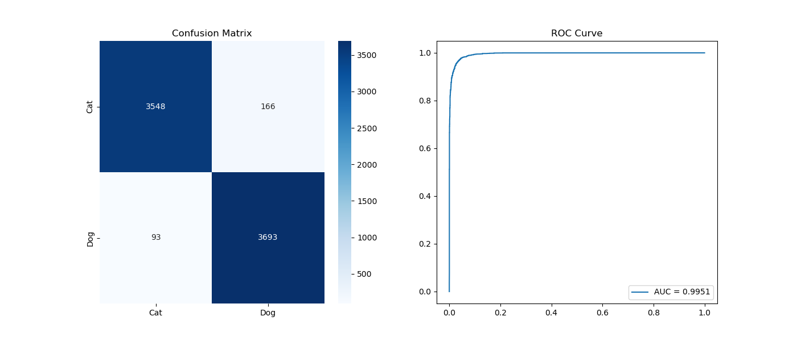

# Cat vs Dog Image Classification

本專案是一個基於 PyTorch 的貓狗影像分類系統，使用 **ResNet18** 作為骨幹網路。


目錄結構如下，為了確保程式能正確讀取圖片，請務必維持以下結構。若使用 Kaggle (https://www.kaggle.com/competitions/dogs-vs-cats/data)下載的 train.zip或是本專案內data/train.zip，解壓縮後可能會有兩層 train/，請確認路徑層級如下：
```text
dogs-vs-cats/
├── data/
│   └── train/
│       └── train/              # 貓狗資料集 
│           ├── cat.0.jpg
│           ├── dog.0.jpg
│           └── ...             (共 25,000 張圖片)
├── model_weight/               # 存放訓練好的模型權重
├── error_analysis/             # 存放評估時抓出的錯誤圖片
├── src/                        
│   ├── dataset.py              # 資料集處理、數據增強
│   ├── model.py                # 模型架構 (resnet18)
│   └── utils.py                # 繪圖與指標計算工具
├── train.py                    # 訓練程式
├── evaluate.py                 # 評估程式
├── requirements.txt            # Python 環境依賴清單
├── results.png                 # 混淆矩陣與 ROC 曲線圖
├── learning_curves.png         # 訓練過程 Loss/Acc 曲線圖
└── README.md                   

安裝與環境設定
複製專案：

git clone <你的專案連結>
cd dogs-vs-cats
建立虛擬環境 (建議)：

python -m venv venv
source venv/bin/activate  # Mac/Linux

安裝依賴套件：
pip install -r requirements.txt


## 使用說明

### 1. 資料準備
請將 train.zip 放入 data/ 資料夾中並解壓縮

> ⚠️ **重要**：確認 `data/train/train/` 底下直接就是 `.jpg` 檔案

### 2. 開始訓練
執行以下指令開始訓練模型。程式會自動將最佳權重儲存在 `model_weight/`：

```bash
python train.py
```

### 3. 模型評估
訓練完成後，使用評估程式產出結果圖表：

```bash
python evaluate.py
```

> 💡 **提示**：在 `evaluate.py` 中可以藉由設置 `EXPORT_ERRORS = 1`（預設為 0，只輸出 Accuracy、Precision、Recall），程式會將模型判斷錯誤的圖片，存入至 `error_analysis/` 資料夾中

## 訓練結果展示

總共訓練 100 個 epoch
- Learning Rate: `0.0001`

### 訓練學習曲線 (Learning Curves)


### 評估指標 (Evaluation Metrics)

| 指標 | 數值 |
|------|------|
| Accuracy | 0.9655 |
| Precision | 0.9570 |
| Recall | 0.9754 |

這裡包含了混淆矩陣 (Confusion Matrix) 與 ROC 曲線，用於分析模型對貓狗分類的精確度。

